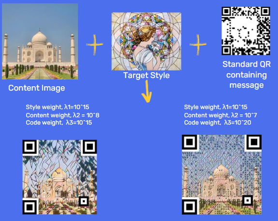
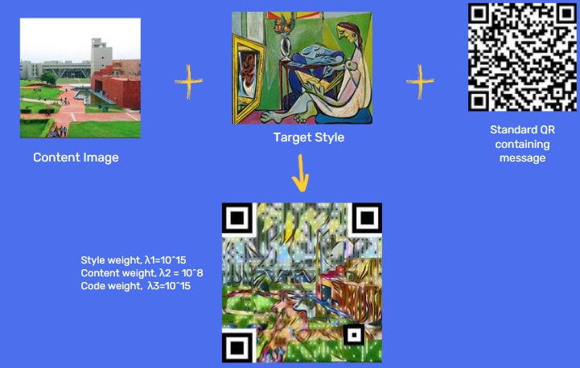

## Pytorch Implementation of "ArtCoder: An End-to-end Method for Generating Scanning-robust Stylized QR Codes"

See [here](https://openaccess.thecvf.com/content/CVPR2021/html/Su_ArtCoder_An_End-to-End_Method_for_Generating_Scanning-Robust_Stylized_QR_Codes_CVPR_2021_paper.html) for the original research paper.

## Sample outputs

